> [Back to  main](./README.md)
## What is SQL ? : 
 

SQL, or Structured Query Language, is a language designed to allow both technical and non-technical users query, manipulate, and transform data from a relational database. And due to its simplicity, SQL databases provide safe and scalable storage for millions of websites and mobile applications.

## Screenshot of SQL Lessons : 

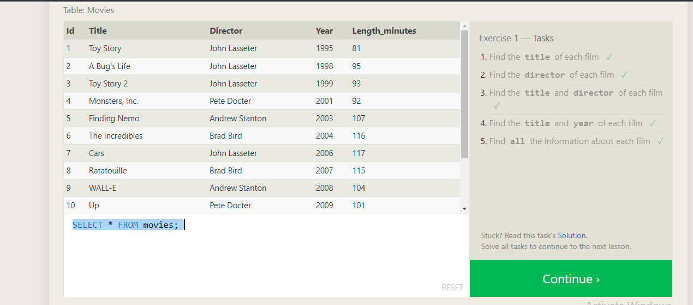
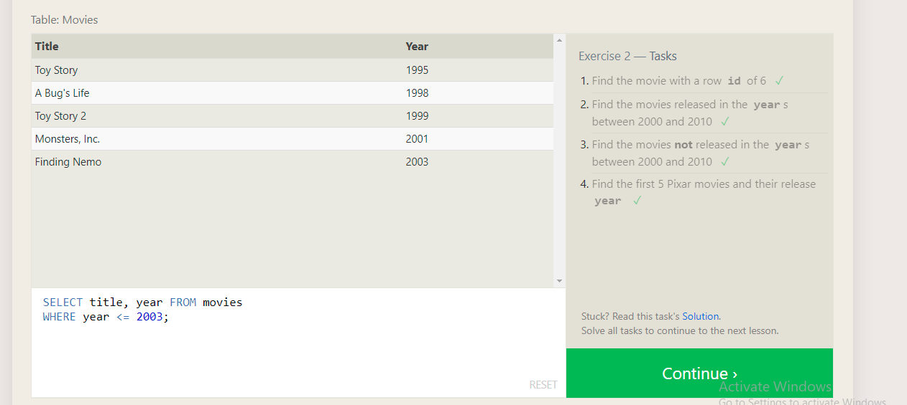
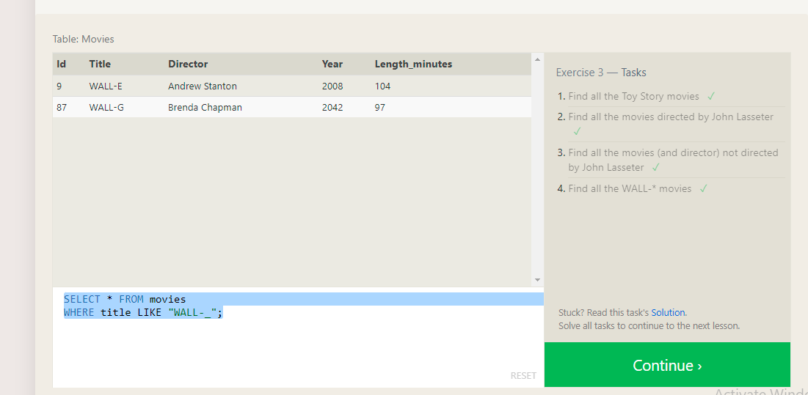
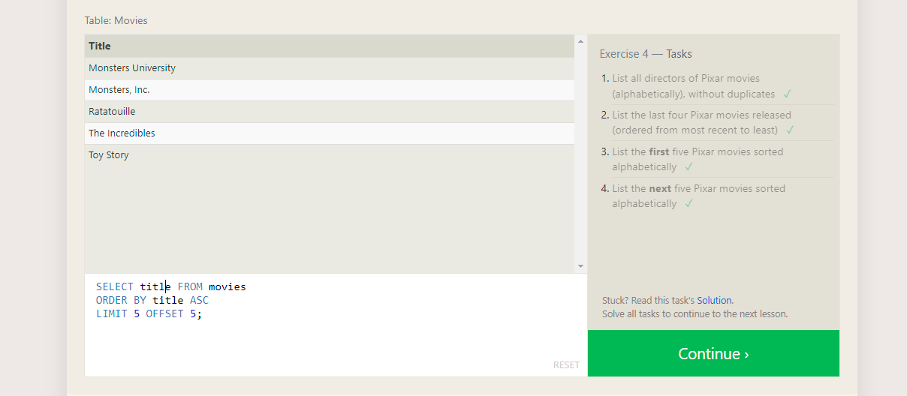

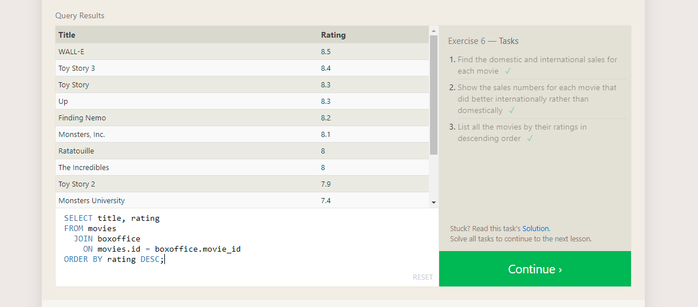
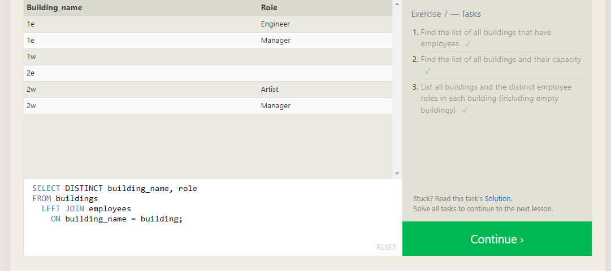
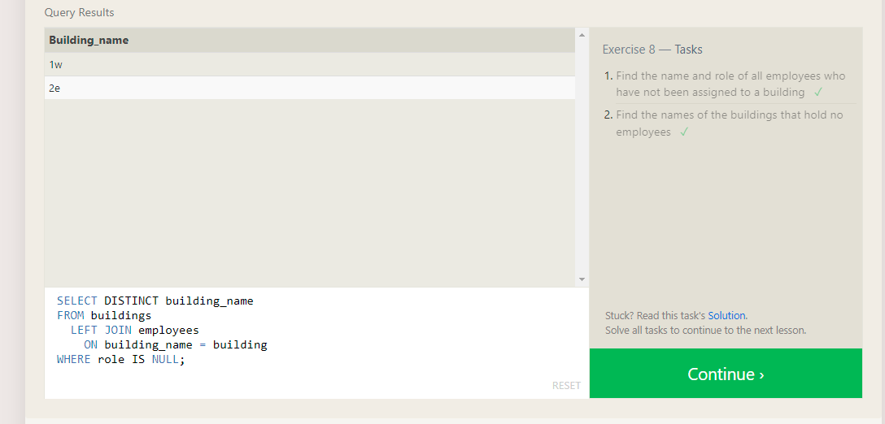
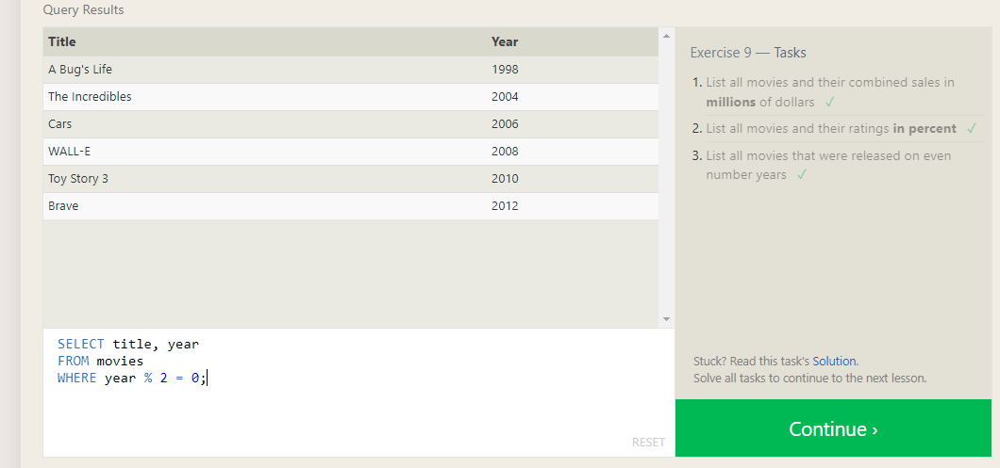
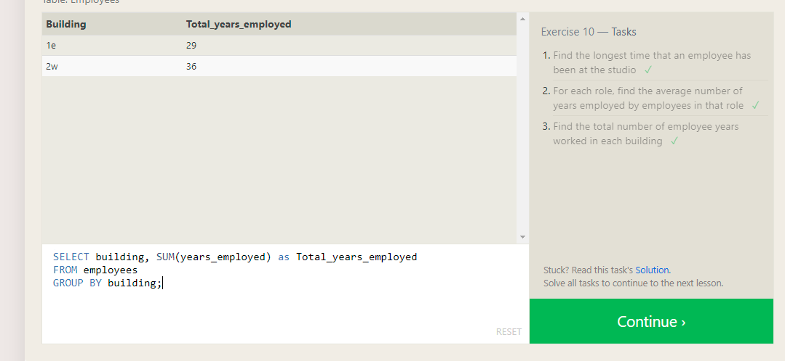
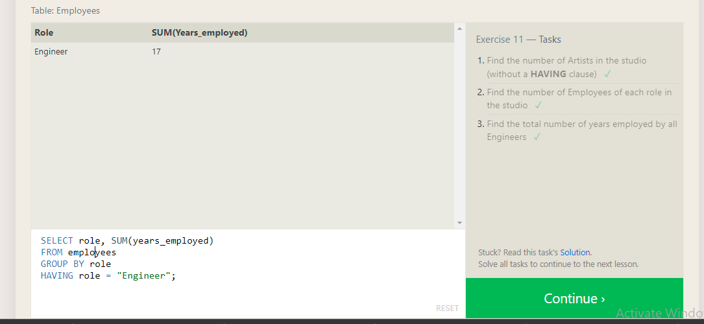
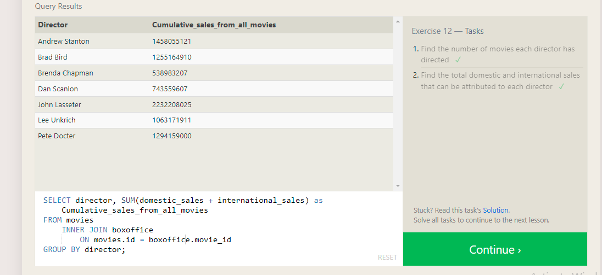
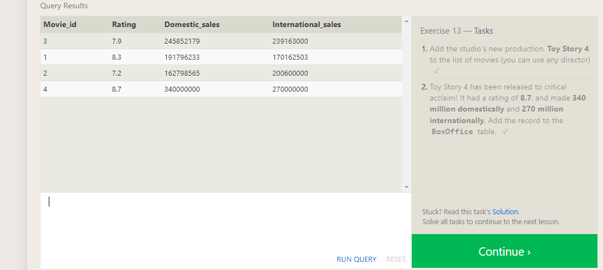
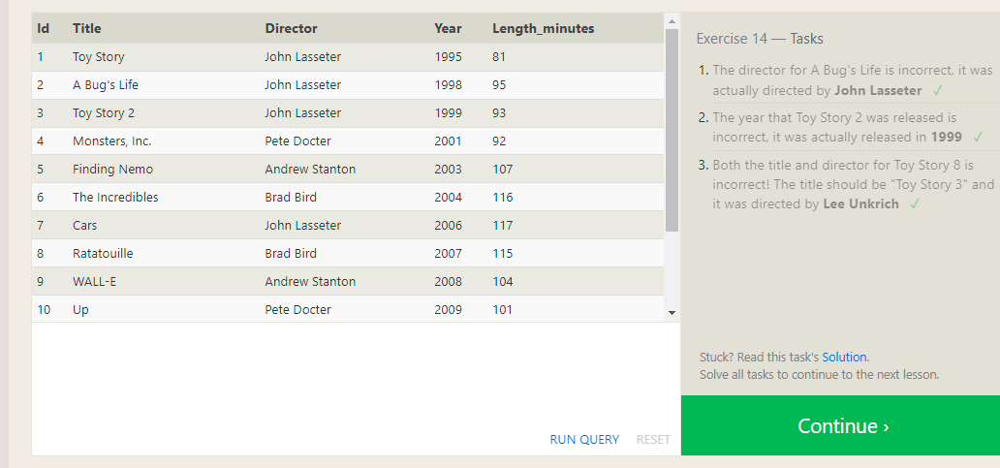
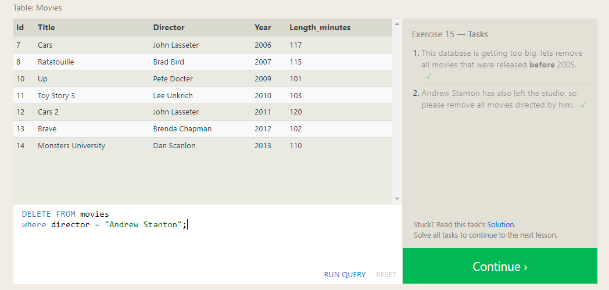
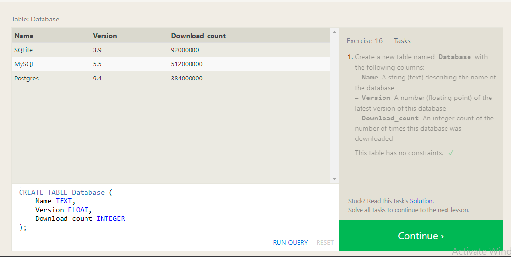
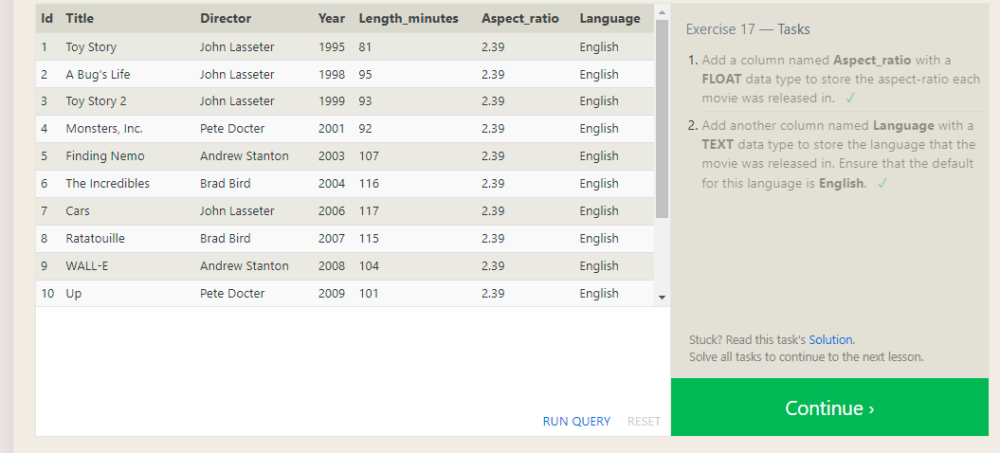
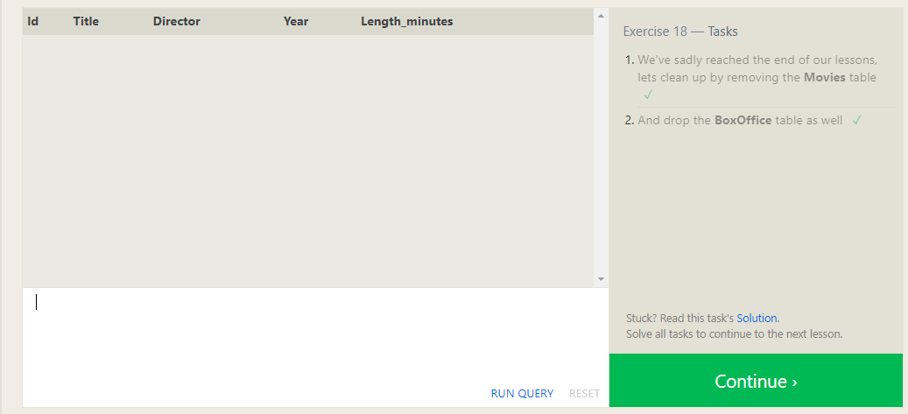